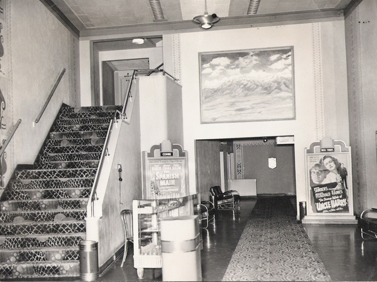

# Lobo Lobby

##### Stairs To Balcony  
##### Shortcut to Backstage  
##### Double Doors to Orchstra Seating  
##### Sunday School Room  

  
The Lobo opened doors in Mid-August 1938, it was a staple of Nob Hill until its close in 2000. In the early aughts, the building was bought by Calvary Church. The church let a number of folks use the space, including Patricio Trujillo. The fearless & queer, leader and educator of generations of Monte Vista Elementary students who needed something to do after school until their parents got out of work. 
